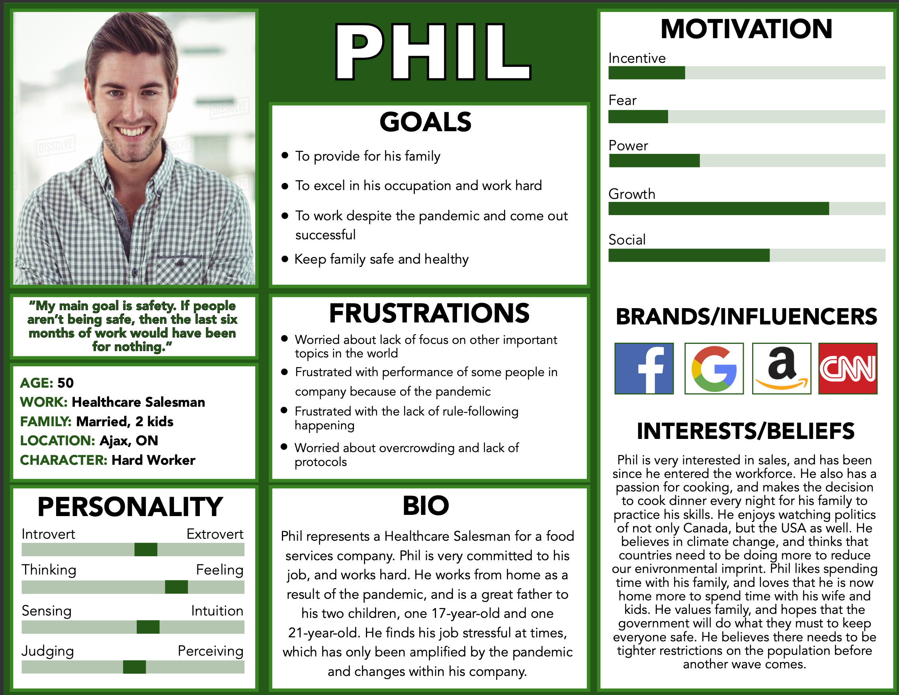

# Works

## Please see below my work in Graphic Design and UX.

### See also my Portfolio hosted on Squarespace: <a href="https://www.tesskibzey.space/"> target="_blank"> Tess Kibzey Portfolio</a>

 

## Graphic Design

 

 

The above posters are examples of the work I did for Art Hawks, a First Year Leadership Program on the Laurier Brantford campus.

They were created using Adobe Illustrator and Adobe Photoshop.

 

 

This poster was created in my high school Communications Technology class.

The project was to create a concert poster for our favourite artist. Fun fact: Harry Styles is still my favourite!

 

## UX Design

**UX100 Term Project: ShopSafe, an app created to limit overcrowding and pollution.**
 

 

 

 

The pictures above are from the process of creating ShopSafe, my app prototype. They were based on user research user feedback.

# My Angle

When it comes to prototyping, it's important to ensure that you are doing all the preliminary steps before starting a prototype. In this assignment, I made sure to perform all of my user research and analysis before beginning work on a low fidelity prototype. Virtual product prototyping aided me in creating this low, medium, and high fidelity prototype for my project since I could not create it physically (Nam et al. 2019).

**References:**
S. Nam, G. Ko, K. Suh and J. Kwon, "User Experience- and Design-Oriented Virtual Product Prototyping System," 2019 11th International Conference on Knowledge and Smart Technology (KST), 2019, pp. 116-120, doi: 10.1109/KST.2019.8687418.

 