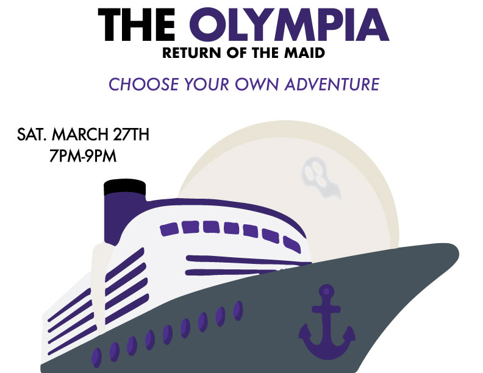

# Works

### Please see below my work in Graphic Design and UX.

 

## Graphic Design

 

 

**The above posters are examples of the work I did for Art Hawks, a First Year Leadership Program on the Laurier Brantford campus.**

**They were created using Adobe Illustrator and Adobe Photoshop.**

 

 

**This poster was created in my high school Communications Technology class.**

**The project was to create a concert poster for our favourite artist. Fun fact: Harry Styles is still my favourite!**

 

## UX Design

**UX100 Term Project: ShopSafe, an app created to limit overcrowding and pollution.**
 

 